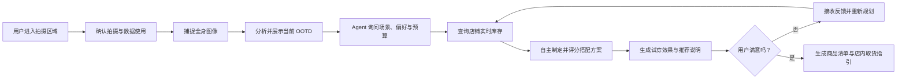
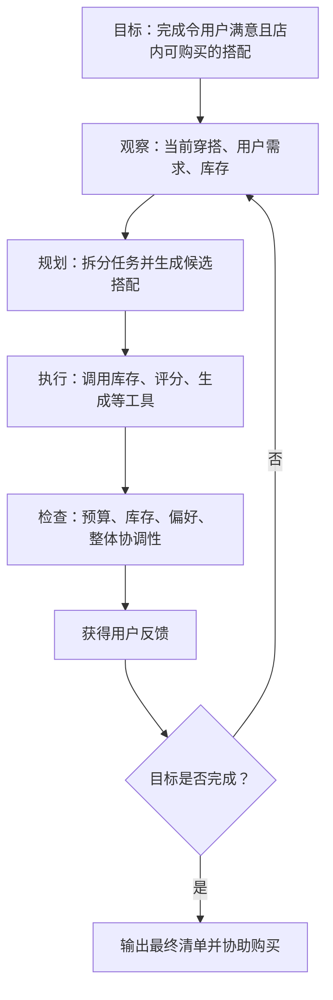
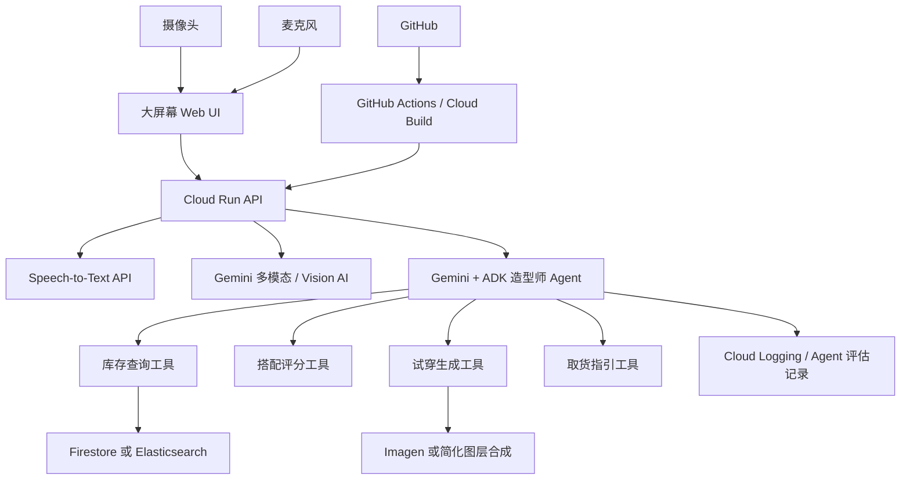

# 动态 AI 试衣间：Hackathon 项目大纲

> 项目暂定名：Dynamic AI Dress Room / AI Styling Agent  
> 文档状态：初版大纲  
> 更新日期：2026-06-14  
> 官方页面：[DevOps × AI Agent Hackathon](https://findy.notion.site/devops-ai-agent-hackathon-2026)

## 1. 项目定位

### 1.1 一句话介绍

部署在大型服装店入口或展示区域的动态 AI 试衣间。AI 造型师 Agent 会观察用户当前穿搭、通过对话理解用户需求、查询店铺实时库存、自主规划完整搭配，并根据用户反馈持续调整方案，最终帮助用户完成店内选购。

### 1.2 目标用户

- 不清楚自己适合什么风格，希望快速获得建议的顾客
- 有明确场景、预算或偏好，但不想逐件寻找商品的顾客
- 希望提高顾客停留时间、试穿率和购买转化率的服装店
- 希望更有效地展示库存商品和搭配方案的店员与品牌方

### 1.3 希望解决的问题

- 顾客面对大量商品时难以快速找到协调的完整搭配
- 普通商品推荐系统通常忽略用户当前穿搭、场景、预算及实时库存
- 顾客需要反复寻找店员，调整搭配过程耗时
- 传统虚拟试衣强调视觉换装，但缺少能够主动完成选品任务的造型顾问

---

## 2. 比赛要求、评审重点与提交注意事项

### 2.1 比赛核心主题

比赛强调从 AI Agent 的企划、开发、部署到运维的完整过程，而不只是制作一个生成式 AI 原型。

官方提出三个核心概念：

1. **つくる / Build**：以 Google Cloud AI 为核心，设计并实现具有实际价值的原创 AI Agent。
2. **まわす / Operate**：通过 GitHub、CI/CD 和监控等 DevOps 流程持续改善 Agent。
3. **とどける / Deliver**：将服务部署到 Cloud Run 等可扩展环境，向用户提供可实际使用的产品。

### 2.2 强制开发要求

- 必须使用至少一种 Google Cloud 应用运行产品。
- 必须使用至少一种 Google Cloud AI 技术。
- 项目必须体现 AI Agent 的自主判断与任务执行能力。
- 应覆盖开发、部署、运行和持续改善过程，而不仅是本地演示。

### 2.3 官方评审重点

#### 1. AI Agent 是否是价值中心

- Agent 是否是作品核心，而不只是附加聊天功能
- Agent 是否能够自主判断并执行任务
- 产品是否存在“必须使用 AI Agent”的理由

#### 2. 对所设问题的解决能力

- 问题、背景、目标用户和产品价值是否清晰
- 故事与解决方案是否一致、合理且具有新意

#### 3. 易用性

- 用户是否能够直观理解和操作
- 功能与视觉设计是否适合真实使用场景

#### 4. 实用性与体验吸引力

- 是否能够有效解决设定的问题
- 是否具有明显、令人印象深刻的体验价值

#### 5. 实现能力

- 技术选型与架构是否合理
- 是否考虑扩展性、实际部署和运维
- 是否有效使用比赛要求的技术

### 2.4 本项目对应的评审策略

| 评审项 | 本项目的展示重点 |
| --- | --- |
| Agent 核心性 | 展示 Agent 如何分析需求、查询库存、制定计划、调用工具和根据反馈重新规划 |
| 问题解决能力 | 强调顾客的选品困难与店铺库存利用效率问题 |
| 易用性 | 使用摄像头、语音、大屏幕、动态 OOTD 卡片降低操作门槛 |
| 体验吸引力 | 中央数字人和环绕式单品动态展示形成强视觉演示 |
| 实现能力 | 展示 Cloud Run 部署、Agent 工具调用、日志、测试和 CI/CD |

### 2.5 参加与时间注意事项

- 参加者必须是居住在日本的 18 岁以上个人。
- 可以个人或组队参加；团队成员均需完成参赛报名。
- 必须以个人私人活动身份参加，不能代表所属公司或组织参赛。
- 参加报名与项目提交截止时间：**2026-07-10 23:59 JST**。
- 一次审查：2026-07-13 至 2026-07-17。
- 二次审查：2026-07-21 至 2026-07-24。
- 决赛团队公布：2026-07-30。
- 最终展示：2026-08-19，Google 涩谷办公室。

### 2.6 提交注意事项

最终正式提交需要：

1. 公开 GitHub 仓库 URL。
2. 已部署并可实际操作的项目 URL。
3. ProtoPedia 项目页面 URL。

ProtoPedia 页面需要准备：

- 项目名称与概要
- YouTube 或 Vimeo 演示视频
- 系统架构图
- 使用的开发工具和技术
- `findy_hackathon` 标签
- 项目故事：
  - 希望解决的问题与背景
  - 目标用户
  - 产品特点
- 最多五张可选介绍图片

### 2.7 法律与隐私注意事项

- 摄像头拍摄前必须获得用户明确同意。
- 应说明照片、语音和生成结果的用途及保存时间。
- 建议会话结束后自动删除用户原始照片和语音。
- 演示素材、服装图片和品牌数据不得侵犯第三方知识产权或肖像权。
- 不应声称系统能够精确判断服装实际尺寸或真实合身程度。

---

## 3. 比赛允许使用的技术

> 以下清单按照官方页面分类整理。“必选”表示必须从该类别中至少选择一项，并不表示该类别内每一项都必须使用。

### 3.1 Google Cloud 应用运行产品：必选至少一项

| 技术 | 简单说明 | 本项目适用方式 |
| --- | --- | --- |
| App Engine | Google Cloud 托管式应用平台，可自动管理基础设施 | 部署普通 Web 服务；本项目优先级低于 Cloud Run |
| Google Compute Engine | Google Cloud 虚拟机服务，提供较高环境控制能力 | 运行需要自定义环境或常驻进程的服务 |
| Google Kubernetes Engine（GKE） | 托管式 Kubernetes 服务，适合复杂微服务与容器编排 | 项目规模扩大后编排多个 Agent 与生成服务 |
| Cloud Run | 无服务器容器运行平台，可按请求自动扩缩 | **推荐作为本项目 API、Agent 和前端服务的主要部署环境** |
| Cloud Functions / 旧 Cloud Functions | 事件驱动的无服务器函数服务 | 处理图片上传、库存更新、异步任务等事件 |
| Cloud TPU | 面向机器学习工作负载的专用加速器 | 需要自行训练或运行大型模型时使用 |
| Cloud GPU | 为图像生成、视觉模型等提供 GPU 算力 | 运行自托管虚拟试衣或图像生成模型 |

### 3.2 Google Cloud AI 技术：必选至少一项

| 技术 | 简单说明 | 本项目适用方式 |
| --- | --- | --- |
| Gemini Enterprise Agent Platform（旧 Vertex AI） | 用于训练、部署、管理 AI 模型和企业级 Agent 的综合平台，包含 AutoML、Vector Search、Explainable AI 等能力 | 管理 Agent、模型调用、检索和企业数据连接 |
| Gemini API | 支持文本、图像等输入的多模态生成式 AI API | **理解用户需求、分析穿搭、制定方案、调用工具并解释推荐理由** |
| Gemma | Google 的开放模型系列，适合自定义与本地化部署 | 处理轻量分类、标签或本地推理任务 |
| Imagen | Google 图像生成技术 | 生成概念化试穿效果或搭配展示图 |
| Agent Builder | 用于构建连接企业数据、搜索和工具的 Agent | 构建可查询库存与执行任务的造型师 Agent |
| ADK（Agent Development Kit） | 用于开发、编排和评估 Agent 的开发套件 | **推荐用于定义 Agent、工具、会话状态和任务流程** |
| Speech-to-Text API | 将用户语音转换为文字 | 接收顾客通过麦克风表达的穿搭需求 |
| Text-to-Speech API | 将 Agent 回复转换为语音 | 让大屏幕 AI 助手以语音回应顾客 |
| Vision AI API | 提供图像理解和视觉分析能力 | 识别当前穿搭类别、颜色、姿态或商品 |
| Natural Language AI API | 提供文本分类、实体和情感等自然语言分析能力 | 提取偏好、场景和反馈；复杂需求可主要交给 Gemini |
| Translation AI API | 提供自动翻译能力 | 支持日本顾客、外国游客等多语言体验 |

### 3.3 官方列出的其他可选技术

| 技术 | 简单说明 | 本项目适用方式 |
| --- | --- | --- |
| Flutter | Google 的跨平台 UI 开发框架 | 构建大屏终端、平板或移动端应用 |
| Firebase | 提供认证、数据库、托管和实时数据等后端能力 | 保存商品数据、会话状态和实时库存信息 |
| Veo | Google 视频生成技术 | 生成穿搭风格演示视频；不建议作为 MVP 核心依赖 |
| Elasticsearch | 搜索、向量检索与可观测性平台，也是本次比赛赞助技术 | 搜索库存、建立服装 RAG、记录并分析 Agent 行为 |

### 3.4 官方页面提到的开发与运维方式

| 技术或方式 | 简单说明 | 本项目适用方式 |
| --- | --- | --- |
| GitHub | 代码管理与协作平台 | 公开源代码、Issue 管理和版本控制 |
| CI/CD | 自动测试、构建和部署流程 | 每次提交后验证并部署 Cloud Run 服务 |
| A2A Protocol | Agent-to-Agent 通信协议 | 让造型 Agent 与库存搜索 Agent 等相互协作 |
| Observability | 对日志、指标、链路和 Agent 行为进行观测 | 分析失败工具调用、延迟、推荐质量与用户反馈 |

---

## 4. 整理后的产品构思流程

### 4.1 完整用户体验流程

1. **吸引与引导**
   - 大屏幕显示动态人物轮廓和站位虚线。
   - 当用户进入指定区域后，系统请求拍摄与数据处理许可。

2. **捕捉与初始分析**
   - 摄像头获取用户全身照片或选取清晰帧。
   - 系统生成用于展示的 2D 数字人或人物抠图。
   - AI 识别用户当前外套、内搭、裤子、鞋子和帽子等 OOTD 信息。

3. **动态展示当前 OOTD**
   - 数字人位于中央。
   - 五类服装以环绕式卡片与动态连线呈现。
   - 卡片展示类别、颜色、风格和当前状态。

4. **AI 造型师主动询问**
   - Agent 询问用户的目标场景、风格、预算和偏好。
   - 用户可以选择预设选项，也可以直接通过语音说明需求。
   - Agent 对信息不足的部分进行必要追问。

5. **Agent 制定搭配计划**
   - 分析当前穿搭中可以保留或需要替换的部分。
   - 查询店铺实时商品、尺码、价格和库存位置。
   - 生成多个候选方案并根据约束进行评分。
   - 选择最佳方案并解释推荐原因。

6. **生成并展示新搭配**
   - 更新中央数字人的试穿状态。
   - 环绕区域切换为推荐商品。
   - 展示总价、搭配理由、库存和商品位置。

7. **交互式修改**
   - 用户点击或拖动任意服装区域，打开备选菜单。
   - 用户表达“不喜欢颜色”“希望更便宜”等反馈。
   - Agent 重新规划受影响单品，并检查整体搭配是否仍然协调。

8. **完成购买辅助**
   - 生成最终商品清单与总价。
   - 提供商品所在区域或建议店内取货顺序。
   - 可选：预约试穿、生成二维码或发送到用户手机。

### 4.2 用户体验流程图

---

## 5. 如何让它真正成为 AI Agent

### 5.1 从“推荐功能”升级为“目标驱动 Agent”

普通推荐功能的工作方式：

- 用户输入一句需求。
- 模型一次性返回一套搭配。
- 用户需要自行判断和继续操作。

本项目中的 Agent 应当：

- 拥有明确目标：在用户限制与店铺库存内，帮助用户完成满意的整套穿搭。
- 主动收集缺失信息，而不是只被动回答。
- 将复杂目标拆分为分析、检索、规划、生成和调整等任务。
- 自主选择并调用工具。
- 检查方案是否满足预算、库存、颜色协调和用户偏好。
- 根据用户反馈重新规划，直到完成目标或明确说明限制。

### 5.2 Agent 可调用的核心工具

| 工具名称 | 作用 | 示例输出 |
| --- | --- | --- |
| `analyze_current_outfit` | 分析用户当前穿搭 | 当前类别、颜色、风格、可保留单品 |
| `extract_user_constraints` | 提取用户需求与限制 | 场景、预算、偏好、禁忌、期望风格 |
| `search_inventory` | 查询店铺商品和实时库存 | 商品、尺码、价格、库存量、位置 |
| `build_outfit_candidates` | 组合多套候选搭配 | 候选套装及构成商品 |
| `score_outfit` | 对搭配进行约束检查和评分 | 协调度、预算符合度、库存可用性 |
| `generate_try_on` | 生成或更新试穿展示 | 数字人展示图或服装图层 |
| `replace_item` | 根据反馈替换指定类别 | 新单品和替换理由 |
| `reserve_items` | 预约商品或试衣间 | 预约结果 |
| `create_store_route` | 生成店内取货顺序 | 商品区域和推荐路线 |
| `explain_recommendation` | 面向用户解释方案 | 简洁、可信的推荐理由 |

### 5.3 Agent 决策循环

### 5.4 可在演示中突出展示的自主行为

- 用户只说“下周去海边，不喜欢露腿，预算两万日元”，Agent 自动识别多个约束。
- Agent 发现所选鞋子无库存后，主动寻找替代品，而不是让流程失败。
- 用户只要求替换外套时，Agent 会重新检查裤子、鞋子与总预算。
- 当预算超出时，Agent 主动比较替代商品，并说明取舍。
- Agent 记录用户“不喜欢鲜艳颜色”的反馈，并在后续方案中持续遵守。

### 5.5 Agent 质量与持续改进

- 建立固定测试场景，例如海边、面试、约会、雨天通勤。
- 检查 Agent 是否遵守预算、库存和偏好。
- 记录工具调用成功率、响应时间和推荐接受率。
- 对失败案例进行回放并调整 Prompt、工具说明或评分规则。
- 通过 CI/CD 在合并代码前运行 Agent 行为测试。

---

## 6. 推荐技术架构

### 6.1 MVP 推荐架构

### 6.2 推荐技术选型

| 层级 | MVP 推荐 | 选择理由 |
| --- | --- | --- |
| 大屏前端 | React / Next.js | 容易实现动态卡片、动画和触控交互 |
| 姿态与人物捕捉 | 浏览器摄像头 + MediaPipe 或简化拍照流程 | 降低实时动作捕捉的实现风险 |
| Agent | Gemini API + ADK | 清晰展示 Agent 规划、工具调用和状态管理 |
| 视觉分析 | Gemini 多模态或 Vision AI | 分析当前穿搭与图片内容 |
| 语音输入输出 | Speech-to-Text + Text-to-Speech | 适合店内大屏自然交互 |
| 库存数据库 | Firestore | 快速构建结构化实时库存 |
| 高级搜索，可选 | Elasticsearch | 支持语义搜索、RAG 和可观测性 |
| 试穿展示 | 图层合成优先，Imagen 作为增强 | MVP 更稳定，避免生成延迟影响演示 |
| 后端部署 | Cloud Run | 满足比赛要求，部署和扩缩简单 |
| CI/CD | GitHub Actions 或 Cloud Build | 展示 DevOps 完整流程 |
| 监控 | Cloud Logging、Trace 与自定义评估日志 | 展示实际运维与 Agent 改善过程 |

### 6.3 建议的服务边界

- `web`：大屏 UI、摄像头、语音和动态 OOTD 展示
- `api`：会话、用户授权、图片上传和业务 API
- `stylist-agent`：Agent 推理、任务规划与工具调用
- `inventory-service`：商品、价格、尺码、库存和位置查询
- `try-on-service`：数字人或试穿展示生成
- `evaluation`：Agent 测试、日志分析和质量评估

### 6.4 DevOps 展示重点

- GitHub 使用清晰的分支、Issue 和 Pull Request 流程。
- Pull Request 自动执行单元测试、Agent 场景测试和前端构建。
- 合并主分支后自动部署到 Cloud Run。
- 保存服务延迟、错误、工具调用和 Agent 任务结果。
- 在演示或提交材料中展示一次“发现失败案例并持续改善”的过程。

---

## 7. 推荐 MVP 范围

### 7.1 MVP 核心目标

在有限时间内完整演示以下闭环：

> 用户照片与需求输入 → Agent 自主查询库存并规划 → 动态展示完整搭配 → 用户反馈 → Agent 重新规划 → 输出可购买商品清单

### 7.2 必须实现

- 用户上传全身照片，或通过摄像头拍摄清晰照片。
- 展示中央人物与五个 OOTD 区域：
  - 外套
  - 内搭
  - 裤子
  - 鞋子
  - 帽子
- 使用 Gemini 分析当前穿搭或生成结构化穿搭描述。
- 支持文字输入，并至少演示一次 Speech-to-Text。
- 使用包含约 30 至 50 件商品的模拟店铺库存。
- Agent 根据场景、偏好、预算与库存自主生成完整搭配。
- 展示 Agent 的工具调用或决策过程。
- 支持选择一个区域并根据用户反馈替换单品。
- 重新检查整体协调性、库存和总预算。
- 输出最终商品清单、总价与店内位置。
- 将可操作版本部署到 Cloud Run。
- 建立最基本的 CI/CD 与日志记录。

### 7.3 建议实现

- Agent 主动追问缺失条件。
- 生成 2 至 3 套候选搭配并说明差异。
- Text-to-Speech 语音回复。
- 商品详情与库存变化的动态展示。
- 最终方案二维码。
- Agent 固定场景测试和评估报告。

### 7.4 暂不纳入 MVP

- 高精度实时视频换装。
- 真实布料物理模拟。
- 精确身体尺寸和服装合身判断。
- 大规模真实商店库存系统接入。
- 多家店铺、跨品牌和支付流程。
- 复杂多 Agent 架构；只有在单 Agent 流程稳定后再考虑加入。
- 完全依赖生成式图片作为每一步交互结果。

### 7.5 MVP 验收标准

| 类别 | 验收标准 |
| --- | --- |
| 用户体验 | 新用户无需说明即可完成一次搭配流程 |
| Agent | 至少自主调用库存查询、搭配评分和替换工具 |
| 约束遵守 | 推荐结果满足库存、预算和明确偏好 |
| 反馈循环 | 用户否定一个单品后，Agent 能重新规划并说明变化 |
| 部署 | 评委可通过公开 URL 操作核心流程 |
| DevOps | GitHub 提交可触发测试和部署，并可查看运行日志 |
| 演示 | 视频中能够清楚看到 Agent 的判断、执行和调整过程 |

---

## 8. 后续扩展方向

- 根据天气、活动地点和日程主动规划穿搭。
- 根据历史反馈学习用户长期风格偏好。
- 将库存搜索、造型规划和店内导航拆分为多个协作 Agent。
- 接入真实门店库存和预约试衣系统。
- 为店员提供推荐理由、库存周转和搭配趋势后台。
- 支持多语言游客与无障碍语音交互。

---

## 9. 当前阶段建议

1. 优先完成可操作的 Agent 闭环，而不是先追求高精度换装。
2. 尽早确定模拟库存数据结构与 Agent 工具接口。
3. 先用静态人物图层和商品卡片实现稳定的视觉演示。
4. 在核心流程跑通后，再加入语音、生成图片和动态特效。
5. 从开发初期就保留 Agent 日志与测试案例，便于展示 DevOps 和持续改善过程。

## 10. 参考资料

- [DevOps × AI Agent Hackathon 官方页面](https://findy.notion.site/devops-ai-agent-hackathon-2026)
- [ProtoPedia](https://protopedia.net/)
- [Agentic AI Bootcamp 2026](https://cloudonair.withgoogle.com/)

