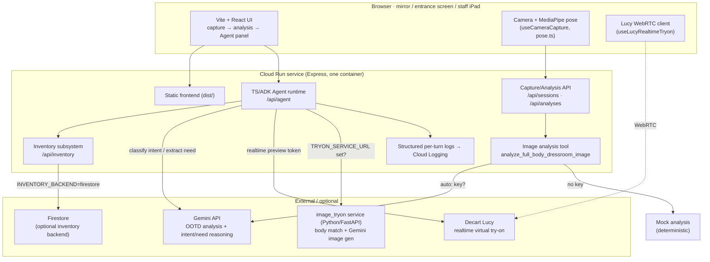
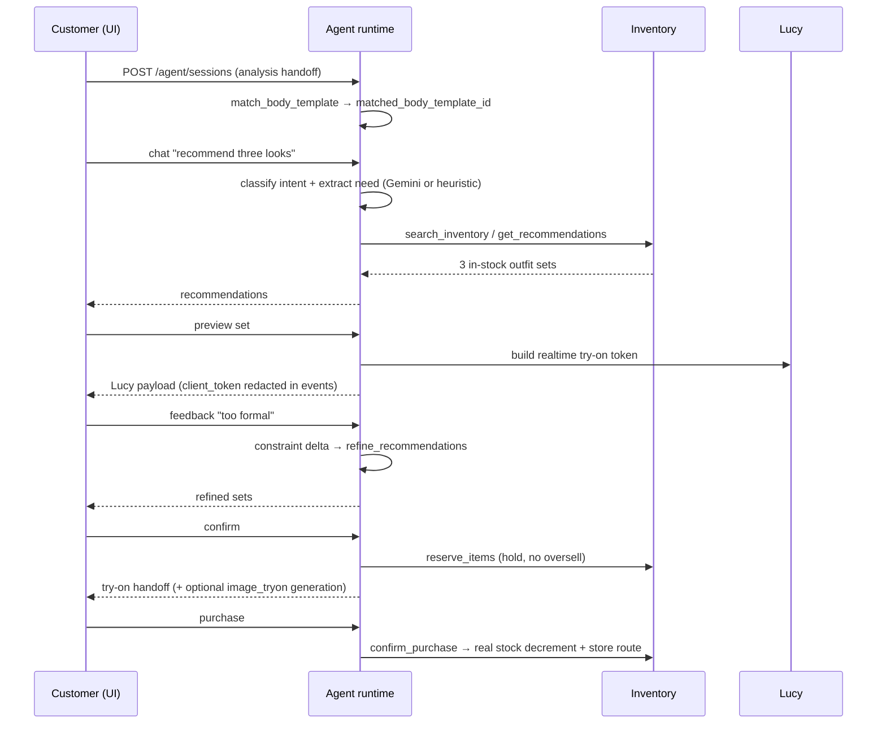
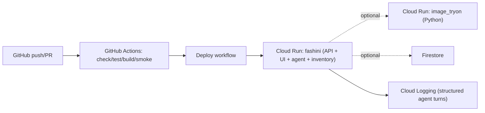

# Architecture

Status: current implementation (v0.2). One Cloud Run service serves the frontend, the capture/analysis API, the TS/ADK Agent runtime, and the inventory subsystem. The image try-on generator runs as a separate optional service.

## 1. System components

## 2. Core demo loop (request flow)

## 3. Runtime surfaces & fallbacks

| Concern | Configured | Fallback (offline/demo) |
|---|---|---|
| OOTD analysis | Gemini (`analysis_mode=auto` + key) | deterministic mock analysis |
| Intent routing / need extraction | Gemini reasoning | `parsers.ts` heuristics |
| Realtime try-on | Decart Lucy (`DECART_API_KEY`) | mock Lucy token metadata |
| Try-on image generation | `image_tryon` via `TRYON_SERVICE_URL` | mock handoff payload |
| Inventory backend | Firestore | in-memory, auto-seeded |
| Session persistence | JSON file (`AGENT_SESSION_STORE_PATH`) | in-memory |

Every external dependency degrades gracefully, so the full agent loop runs with zero keys — that is what CI's `smoke:agent` exercises.

## 4. DevOps

- **CI** (`.github/workflows/ci.yml`): `check` → `test` (23 cases: inventory + agent golden cases) → `build` → end-to-end `smoke:agent`, on every push/PR.
- **Deploy** (`.github/workflows/deploy.yml`, `scripts/deploy-cloudrun.sh`): container → Cloud Run; no-ops safely without GCP secrets.
- **Observability**: each agent turn emits one-line JSON (`event/session_id/route/tool_calls/status/output_type/latency_ms`) that Cloud Logging parses into queryable fields.
- **Privacy**: no face identity recognition; body handling is template-based (no measurements); face profiles are consent-gated; raw Lucy `client_token` is redacted from ADK event text.

## 5. Deployment topology

