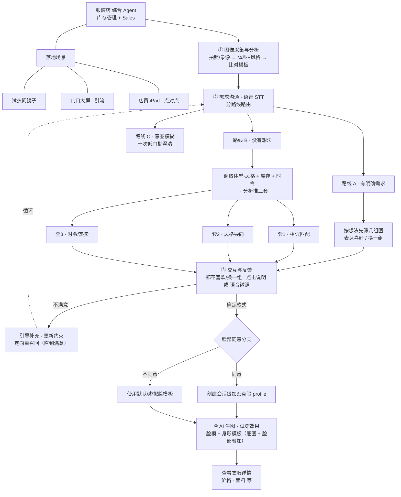
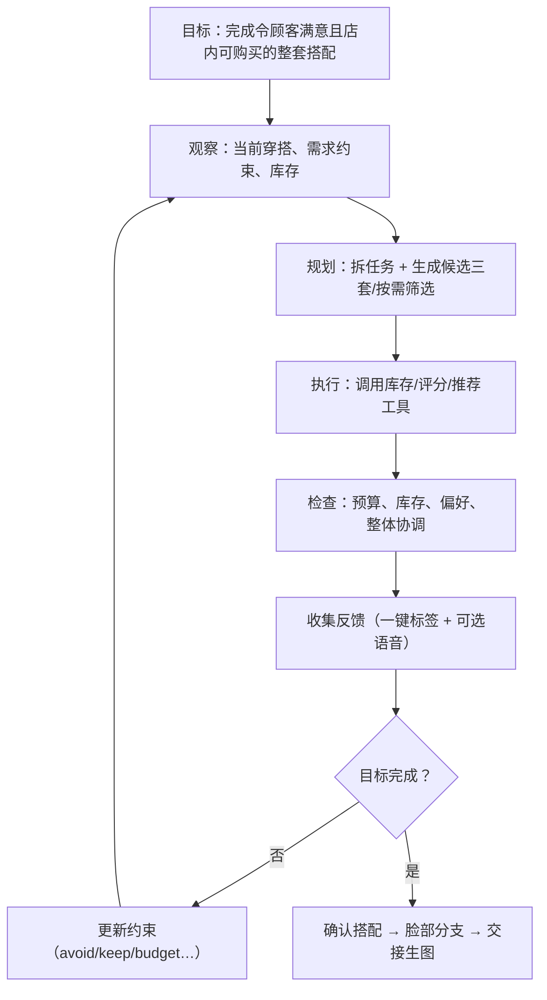

# 服装店库存 + 销售 Agent：Hackathon 项目文档

> 项目暂定名：Clothing Store Inventory + Sales Agent
> 文档状态：开发实施版（基于初版大纲结构 + 新版工程 Plan 内容）
> 更新日期：2026-06-18
> 官方页面：[DevOps × AI Agent Hackathon](https://findy.notion.site/devops-ai-agent-hackathon-2026)

---

## 0. 文档说明

本文件是项目的**主开发文档**，面向团队协作落地。它在初版大纲（比赛定位 / 评审策略 / 技术清单）的骨架上，整合了新版 Plan 的全部工程内容（数据模型 / Agent 状态机 / 工作流节点 / 工具契约 / 反馈循环规则 / 分工 / GitHub 流程）。

阅读建议：
- 想了解**项目是什么、对什么比赛、怎么拿分** → 读第 1、2、3 节。
- 想**动手开发** → 直接跳到第 5（数据模型）、第 6（Agent 设计）、第 7（工具契约）、第 9（构建顺序）、第 10（协作流程）。
- 想知道**这一版做什么、不做什么** → 读第 4.2（Scope）与第 8（MVP 范围）。

配套工程文档：
- `COMPETITION_RULES_AUDIT.md`：比赛规则审计与本项目打法校准。
- `TEAM_CONTRACTS.md`：跨团队共同确认的 DTO、枚举与字段变更规则。
- `TOOL_SCHEMAS.md`：Agent 工具 request/response schema。
- `AGENT_WORKFLOW_SPEC.md`：Agent 工作流节点、状态变更与失败路径。
- `DATABASE_SCHEMA_NOTES.md`：数据库边界与表字段草案。
- `DEMO_SCRIPT.md`：最小演示路径与评审证据。
- `DEPLOYMENT_AND_DEVOPS.md`：Cloud Run、CI/CD、日志与提交检查清单。

一个贯穿全文的核心定位：**系统应当像一位销售顾问，而不是一个静态推荐器**。它理解顾客意图、调用库存/推荐工具、对反馈做出反应、持续精修方案，并把确认后的搭配交给虚拟试穿/生图模块。

---

## 1. 项目定位

### 1.1 一句话介绍

一个集成「库存感知的商品推荐」与「店内销售辅助」的服装店 Agent。它面向三个零售触点部署，能观察顾客当前穿搭、通过语音/点击理解需求、查询店铺库存、自主规划并精修搭配，最终把确认的搭配交给试穿生图模块完成店内选购闭环。

### 1.2 三个落地场景（触点）

| 场景 | 用途 | 交互模式 |
| --- | --- | --- |
| 试衣间镜子（fitting room mirror） | 自助式搭配推荐与试穿流程 | 顾客直接与镜面 UI + 语音交互 |
| 门口大屏（storefront screen） | 引流与快速推荐 | 低门槛、短会话交互 |
| 店员 iPad（staff iPad） | 一对一辅助销售 | 店员可引导或接管整个流程 |

三个场景**共用同一套后端**，区别只在会话的 `scene_type` 字段。

### 1.3 目标用户

- 不清楚自己适合什么风格、希望快速获得建议的顾客。
- 有明确场景/预算/偏好、但不想逐件翻找商品的顾客。
- 希望提高顾客停留时间、试穿率与购买转化率的服装店。
- 希望更高效地展示库存与搭配方案的店员与品牌方。

### 1.4 希望解决的问题

- 顾客面对大量商品时，难以快速找到协调的完整搭配。
- 普通推荐系统通常忽略顾客当前穿搭、场景、预算与实时库存。
- 顾客需要反复寻找店员，调整搭配过程耗时。
- 传统虚拟试衣强调视觉换装，但缺少能主动完成选品任务的造型顾问。

---

## 2. 比赛要求、评审重点与提交注意事项

### 2.1 比赛核心主题

比赛强调从 AI Agent 的企划、开发、部署到运维的**完整过程**，而非仅制作一个生成式 AI 原型。官方三个核心概念：

1. **つくる / Build**：以 Google Cloud AI 为核心，设计并实现具有实际价值的原创 AI Agent。
2. **まわす / Operate**：通过 GitHub、CI/CD、监控等 DevOps 流程持续改善 Agent。
3. **とどける / Deliver**：将服务部署到 Cloud Run 等可扩展环境，向用户交付可实际使用的产品。

### 2.2 强制开发要求

- 必须使用至少一种 Google Cloud 应用运行产品（本项目用 **Cloud Run**）。
- 必须使用至少一种 Google Cloud AI 技术（本项目用 **Gemini API + ADK**）。
- 项目必须体现 AI Agent 的**自主判断与任务执行**能力。
- 应覆盖开发、部署、运行与持续改善，而不仅是本地演示。

### 2.3 官方评审重点

1. **AI Agent 是否是价值中心**：Agent 是否为核心而非附加聊天；是否能自主判断与执行；是否存在「必须用 Agent」的理由。
2. **对所设问题的解决能力**：问题、背景、目标用户、价值是否清晰；故事与方案是否一致、合理、有新意。
3. **易用性**：用户能否直观理解与操作；功能与视觉是否适合真实场景。
4. **实用性与体验吸引力**：能否有效解决问题；体验是否令人印象深刻。
5. **实现能力**：技术选型与架构是否合理；是否考虑扩展性、部署与运维；是否有效使用要求的技术。

### 2.4 本项目对应的评审策略

| 评审项 | 本项目展示重点 |
| --- | --- |
| Agent 核心性 | 展示 Agent 如何路由意图、解析需求、调用库存/推荐工具、**根据结构化反馈更新约束并重新规划**（反馈循环是核心证据） |
| 问题解决能力 | 强调顾客选品困难与店铺库存利用效率；三触点覆盖真实零售动线 |
| 易用性 | 语音 + 一键反馈标签（不要求顾客会描述）+ 三套搭配并排呈现，降低操作门槛 |
| 体验吸引力 | 「不满意 → 定向精修 → 再推」的可见循环 + 确认后试穿生图 |
| 实现能力 | 展示 Cloud Run 部署、ADK 工具调用、会话状态、日志/Trace、CI/CD |

> 关键论点：本项目的 Agent 必然性集中在**反馈循环**——顾客说「颜色不喜欢」，Agent 不是随机重推，而是把该约束写入 `avoid` 并定向重召回。删掉这个循环，系统就退化成推荐器。这是过「Agent 是否价值中心」这一评审项的命门。

### 2.5 参加与时间注意事项

- 参加者须为居住在日本的 18 岁以上个人；可个人或组队，团队成员均需完成报名。
- 必须以个人私人活动身份参加，不能代表所属公司/组织。
- 报名与项目提交截止：**2026-07-10 23:59 JST**。
- 一次审查：2026-07-13 至 2026-07-17；二次审查：2026-07-21 至 2026-07-24。
- 决赛团队公布：2026-07-30；最终展示：2026-08-19，Google 涩谷办公室。

### 2.6 提交注意事项

最终正式提交需要：

1. 公开 GitHub 仓库 URL。
2. 已部署并可实际操作的项目 URL。
3. ProtoPedia 项目页面 URL。

ProtoPedia 页面需准备：项目名称与概要、YouTube/Vimeo 演示视频、系统架构图、使用的开发工具与技术、`findy_hackathon` 标签、项目故事（问题与背景 / 目标用户 / 产品特点）、最多五张可选介绍图。

### 2.7 法律与隐私注意事项（本项目重点）

- 摄像头拍摄前必须获得用户**明确同意**，尤其大屏/镜子对匿名顾客采集时。
- 说明照片、语音、生成结果的用途及保存时间；建议会话结束后自动删除原始照片与语音。
- **体型数据模糊化**：只存「匹配到的体型模板 ID」，不存精确身体测量值。
- **脸部数据按同意分支处理**：同意才创建会话级加密真脸 profile，并设过期删除；不同意则使用默认/虚拟脸模板。默认脸应基于体型模板、风格上下文或用户显式选择来挑选，**不做隐藏的人脸相似度分析**。
- 演示素材、服装图片、品牌数据不得侵犯第三方知识产权或肖像权。
- 不声称系统能精确判断服装实际尺寸或真实合身程度。

---

## 3. 比赛允许使用的技术与本项目选型

> 「必选」表示须从该类别至少选一项，并非每项都要用。

### 3.1 Google Cloud 应用运行产品：必选至少一项

| 技术 | 简单说明 | 本项目适用方式 |
| --- | --- | --- |
| App Engine | 托管式应用平台 | 普通 Web 服务；优先级低于 Cloud Run |
| Compute Engine | 虚拟机服务 | 需自定义环境/常驻进程时 |
| GKE | 托管 Kubernetes | 规模扩大后编排多服务 |
| **Cloud Run** | 无服务器容器，按请求自动扩缩 | **本项目 API / Agent / 前端的主要部署环境** |
| Cloud Functions | 事件驱动函数 | 处理图片上传、库存更新、异步任务 |
| Cloud TPU / GPU | ML 加速器 | 自托管生图/视觉模型时 |

### 3.2 Google Cloud AI 技术：必选至少一项

| 技术 | 简单说明 | 本项目适用方式 |
| --- | --- | --- |
| Gemini Enterprise Agent Platform（旧 Vertex AI） | 模型/Agent 综合平台 | 托管 Agent、模型调用、检索、企业数据连接 |
| **Gemini API** | 多模态生成式 AI | **理解需求、分析穿搭、路由、解析反馈、解释推荐理由** |
| Gemma | 开放模型 | 轻量分类/标签/本地推理 |
| Imagen | 图像生成 | 生成试穿效果图（底图 + 脸部叠加） |
| Agent Builder | 构建连接企业数据的 Agent | 可查询库存与执行任务的 Agent |
| **ADK（Agent Development Kit）** | Agent 开发/编排/评估套件 | **定义 Agent、工具、会话状态、Sequential/Parallel/Loop 编排** |
| Speech-to-Text | 语音转文字 | 接收顾客语音需求与反馈 |
| Text-to-Speech | 文字转语音 | 大屏/镜子语音回应（可选） |
| Vision AI | 图像理解 | 备选的穿搭类别/颜色识别 |
| Natural Language AI | 文本分类/实体/情感 | 备选的偏好/反馈解析；复杂需求主要交给 Gemini |
| Translation AI | 自动翻译 | 多语言（日本顾客 + 访日游客） |

### 3.3 官方列出的其他可选技术

| 技术 | 简单说明 | 本项目适用方式 |
| --- | --- | --- |
| Flutter | 跨平台 UI | 大屏终端 / iPad / 移动端 |
| Firebase | 认证/数据库/托管/实时数据 | 商品数据、会话状态、实时库存（Firestore 首选） |
| Veo | 视频生成 | 穿搭演示视频；不建议作 MVP 核心 |
| Elasticsearch（赞助技术） | 搜索/向量检索/可观测性 | 库存语义搜索、服装 RAG、Agent 行为记录（叠加加分项） |

### 3.4 官方提到的开发与运维方式

| 技术或方式 | 简单说明 | 本项目适用方式 |
| --- | --- | --- |
| GitHub | 代码管理与协作 | 公开源码、Issue 管理、版本控制（见第 10 节） |
| CI/CD | 自动测试/构建/部署 | 每次提交验证并部署 Cloud Run |
| A2A Protocol | Agent-to-Agent 通信 | 造型 Agent 与库存搜索 Agent 协作（可选进阶） |
| Observability | 日志/指标/链路/Agent 行为观测 | 分析失败工具调用、延迟、推荐质量、用户反馈 |

### 3.5 框架选型结论（为什么用 ADK）

| 决策 | 当前方向 |
| --- | --- |
| Agent 框架 | **优先 Google ADK**，使用其 graph / dynamic workflow |
| 不自己从零搭 | 从零要重造工具调用循环、状态管理、编排、重试、会话持久化，不值得 |
| 为什么 ADK | GCP 原生、与 Cloud Run/Vertex 打通；原生多模态契合「拍照分析 + 生图」；内置 Sequential/Parallel/Loop 正好对应本流程结构 |
| ADK 必踩的坑 | Cloud Run 容器重启会丢内存会话；配置不当曾致**不同用户看到彼此会话数据**。务必显式配置外部持久化存储并验证 session 隔离（本项目一个 session = 一位顾客的服务，串号即隐私事故） |
| 退路 | 若团队特别在意成熟度/可观测性，可退用 LangGraph；不选 OpenAI Agents SDK（绑定 OpenAI 模型，与「Google 全家桶」冲突） |

---

## 4. 产品构思流程与范围

### 4.1 核心用户流程（思维导图）

下图是完整工作流的思维导图，从落地场景、图像采集、双路线需求沟通、反馈循环到 AI 生图：



### 4.2 本版 Scope（极重要：先定边界再开发）

本版 Hackathon 实现，**核心工作项是 Agent 基座（Agent Foundation）**。Agent 通过工具/接口消费库存、推荐、生图等系统，但**不拥有这些系统的内部实现**。

**In Scope（Agent 基座）**

- 工作流编排（workflow orchestration）。
- 会话状态设计（session state）。
- 工具调用 schema（tool-calling schema）。
- 意图路由：明确需求 / 推荐请求 / 意图不清。
- 从语音转写或 UI 输入解析需求（requirement parsing）。
- 从一键标签 + 可选语音解析反馈（feedback parsing）。
- 为下一轮推荐更新约束的逻辑（constraint update）。
- 到生图模块的交接契约（handoff contract）。
- 开发期用 mock 工具替代库存/推荐/生图。

**Out of Scope（Agent 基座不负责）**

- 真实商品数据库实现。
- 真实库存管理后台 UI。
- 真实推荐算法内部实现。
- 真实生图模型实现。
- 真实摄像头/体型分析模型实现。
- 长期顾客画像系统。

### 4.3 核心用户流程（线性版）

```text
顾客进入三个场景之一
  -> 会话开始（session 起）
  -> 摄取图像/体型/风格分析结果
  -> 顾客语音或点击输入
  -> Agent 路由会话
     -> 路线 A：顾客有明确需求
     -> 路线 B：顾客请求推荐
     -> 路线 C：意图不清，问一个低门槛澄清问题
  -> Agent 调用推荐/库存工具
  -> 展示搭配套装
  -> 顾客确认 / 拒绝 / 给反馈
  -> Agent 更新约束，必要时循环
  -> 顾客确认搭配
  -> Agent 检查脸部授权分支
  -> Agent 交接给试穿生图
  -> 可展示商品详情
```

### 4.4 重要产品决策一览

| 决策 | 当前方向 |
| --- | --- |
| 主产品定义 | 集成式服装店库存 + Sales Agent |
| 数据中心 | `session_id` first（会话为中枢） |
| 顾客表 | 第一版**不实现** |
| 跨会话记忆 | 第一版**不实现** |
| 体型数据 | 存「匹配到的体型模板 ID」，不存精确测量 |
| 脸部处理 | 按同意（consent）分支 |
| 同意 = 是 | 为本会话创建加密真脸 profile |
| 同意 = 否 | 使用最接近/默认的虚拟脸模板 |
| Agent 框架 | 优先 Google ADK 2.0 graph / dynamic workflow |
| 推荐循环 | 反馈维度更新约束，再重召回推荐 |

---

## 5. 数据模型（高粒度）

第一版**避免长期 `customers` 表**；动态状态以会话为中心。

### 5.1 商品侧表（可由库存/商品组拥有）

#### `products`

| 字段 | 含义 |
| --- | --- |
| `product_id` | 商品 ID |
| `sku` | SKU |
| `name` | 商品名 |
| `category` | 上装/下装/连衣裙/外套等 |
| `price` | 价格 |
| `fabric` | 面料/材质描述 |
| `color` | 主色 |
| `size_list` | 可选尺码列表 |
| `style_tags` | 结构化风格标签（须与分析侧 `current_style` 同一词表） |
| `body_fit_tags` | 体型模板适配标签 |
| `is_seasonal` | 当季/热卖标记 |
| `created_at` | 上架时间 |

#### `inventory`

| 字段 | 含义 |
| --- | --- |
| `inventory_id` | 库存记录 ID |
| `product_id` | 商品引用 |
| `size` | 尺码 |
| `color` | 颜色 |
| `quantity` | 当前库存数（缺货不推荐） |
| `store_id` | 门店 ID |

#### `product_images`

| 字段 | 含义 |
| --- | --- |
| `image_id` | 图片 ID |
| `product_id` | 商品引用 |
| `image_url` | 图片 URL |
| `image_type` | 主图/细节/平铺/底图（生图底图来源） |
| `sort_order` | 显示顺序 |

### 5.2 Agent 侧表

#### `sessions`

| 字段 | 含义 |
| --- | --- |
| `session_id` | 本次服务会话 |
| `scene_type` | `mirror` / `storefront_screen` / `staff_ipad` |
| `store_id` | 门店 ID |
| `status` | `analyzing` / `communicating` / `recommending` / `refining` / `confirmed` / `ended` |
| `route` | `explicit` / `recommendation` / `unclear` |
| `started_at` | 开始时间 |
| `ended_at` | 结束时间 |

#### `analysis_results`

| 字段 | 含义 |
| --- | --- |
| `analysis_id` | 分析记录 ID |
| `session_id` | 会话引用 |
| `matched_body_template_id` | 匹配到的体型模板 ID（不存精确身材） |
| `current_style` | 识别出的当前穿搭风格 |
| `photo_url` | 原始图 URL，建议设过期 |
| `confidence` | 模型置信度 |
| `created_at` | 分析时间 |

#### `session_face_profiles`

| 字段 | 含义 |
| --- | --- |
| `face_profile_id` | 脸部 profile 记录 ID |
| `session_id` | 会话引用 |
| `consent_given` | 是否授权使用真脸 |
| `face_mode` | `real_face` / `default_face` |
| `face_data_encrypted` | 加密真脸数据，仅在授权时存 |
| `default_face_template_id` | 拒绝授权时的默认脸模板 |
| `match_basis` | 选择默认脸的依据 |
| `expire_at` | 删除/过期时间 |
| `created_at` | 创建时间 |

同意逻辑：

```text
若 consent_given = true:
  创建会话级真脸 profile
  set face_mode = real_face
  存加密脸数据并设过期

若 consent_given = false:
  不创建真脸模型
  set face_mode = default_face
  选择 default_face_template_id
```

> 为降低风险，默认脸应基于体型模板、风格上下文或用户显式选择来挑选，而非隐藏的人脸相似度分析。

#### `recommendation_sets`

| 字段 | 含义 |
| --- | --- |
| `set_id` | 推荐组 ID |
| `session_id` | 会话引用 |
| `round` | 推荐轮次（反馈循环会有多轮） |
| `rec_type` | `similar` / `style` / `seasonal` / `explicit_need` |
| `product_combo` | 搭配/商品组合 |
| `reason` | 推荐理由 |
| `created_at` | 创建时间 |

#### `feedbacks`

| 字段 | 含义 |
| --- | --- |
| `feedback_id` | 反馈 ID |
| `set_id` | 目标推荐组 |
| `session_id` | 会话引用 |
| `feedback_type` | `reject_all` / `partial_adjust` / `positive_keep` / `confirm` |
| `dimension` | `color` / `fit` / `style` / `price` / `overall`（一键点选，不要求顾客描述） |
| `dimension_value` | 具体值（可选） |
| `raw_voice_text` | 可选语音转写 |
| `parsed_intent` | 解析后的结构化反馈 |
| `created_at` | 反馈时间 |

#### `generated_images`（可由生图组拥有，Agent 只读状态）

| 字段 | 含义 |
| --- | --- |
| `image_id` | 生图 ID |
| `session_id` | 会话引用 |
| `set_id` | 推荐组引用 |
| `product_combo` | 用到的商品组合 |
| `base_template_id` | 用到的体型底图模板 |
| `face_mode` | `real_face` / `default_face` |
| `result_url` | 试穿效果图 URL |
| `status` | `pending` / `success` / `failed` / `retrying` |
| `created_at` | 创建时间 |

### 5.3 跨表关系要点

- 所有动态记录都挂在 `session_id` 下（分析、脸部、推荐、反馈、生图）→ 三场景共用一套后端，仅看 `scene_type`。
- 一次 session 可有多轮 `recommendation_sets`（因反馈循环）；每组可对应若干 `feedbacks`。
- `products` 是静态地基，`inventory` 与 `product_images` 挂其下。
- `current_style`（分析侧）与 `style_tags`（商品侧）必须共用同一词表，否则相似匹配对不上。

---

## 6. Agent 设计

### 6.1 从「推荐功能」升级为「目标驱动 Agent」

普通推荐：用户输入一句 → 模型一次性返回一套 → 用户自行判断。

本项目 Agent 应当：
- 拥有明确目标：在顾客约束与店铺库存内，帮其完成满意的整套搭配。
- 主动收集缺失信息，而非只被动回答。
- 把目标拆为分析、检索、规划、生成、调整等任务。
- 自主选择并调用工具。
- 检查方案是否满足预算、库存、颜色协调与偏好。
- 根据反馈重新规划，直到完成目标或明确说明限制。

### 6.2 Agent 会话状态（结构化 state）

```json
{
  "session_id": "",
  "scene_type": "mirror",
  "status": "communicating",
  "route": "unclear",
  "analysis": {
    "matched_body_template_id": "",
    "current_style": [],
    "confidence": 0.0
  },
  "consent": {
    "face_consent_given": false,
    "face_mode": "default_face"
  },
  "user_need": {
    "category": [],
    "style_tags": [],
    "colors": [],
    "budget_range": null,
    "occasion": null,
    "avoid": [],
    "keep": []
  },
  "recommendation_round": 0,
  "shown_set_ids": [],
  "selected_set_id": null,
  "feedback_history": [],
  "loop_status": "collecting"
}
```

### 6.3 Agent 工作流节点（ADK graph）

```text
SessionInit
  -> ConsentCheck
  -> AnalysisIngest
  -> UserInputNormalize
  -> IntentRouter
  -> NeedParser
  -> RecommendationToolCall
  -> RecommendationPresenter
  -> FeedbackCollector
  -> FeedbackParser
  -> ConstraintUpdater
  -> LoopController
  -> OutfitConfirm
  -> FaceConsentBranch
  -> TryonHandoff
```

对应 ADK 编排原语：
- **Sequential**：SessionInit → ConsentCheck → AnalysisIngest → UserInputNormalize → IntentRouter（主干顺序）。
- **Parallel**：路线 B 同时生成 similar / style / seasonal 三套。
- **Loop**：FeedbackCollector → FeedbackParser → ConstraintUpdater → LoopController（不满意循环）。

### 6.4 意图路由逻辑

| 路线 | 触发 | Agent 行为 |
| --- | --- | --- |
| `explicit` | 顾客有具体请求 | 解析约束，调用 explicit 推荐 |
| `recommendation` | 顾客说没想法 | 生成 similar / style / seasonal 三套 |
| `unclear` | 意图模糊/混杂 | 问一个低门槛澄清问题 |

路线 B 的三套：

| 套 | 类型 | 依据 |
| --- | --- | --- |
| Set 1 | Similar 相似 | 当前穿搭风格 + 体型模板 |
| Set 2 | Style-led 风格导向 | 店铺主打风格标签 |
| Set 3 | Seasonal 时令 | 热卖/当季库存 |

### 6.5 Agent 决策循环（图示）



### 6.6 可在演示中突出的自主行为

- 顾客只说「下周去海边、不喜欢露腿、预算两万日元」，Agent 自动识别多个约束。
- 顾客点「颜色不喜欢」，Agent 把该颜色加入 `avoid`、**保留其它约束**、定向重召回，而非随机重推。
- 顾客只要求换外套时，Agent 重新检查裤子、鞋子与总预算是否仍协调。
- 所选商品无库存时，Agent 主动找替代而非让流程失败。
- Agent 把「正向保留」的单品加入 `keep`，后续方案持续遵守。

---

## 7. 工具契约（Tool Contracts）

Agent 基座应以稳定 JSON schema 定义工具。

| 工具 | 拥有方 | 用途 |
| --- | --- | --- |
| `get_recommendations` | 推荐/库存 | 获取搭配候选 |
| `refine_recommendations` | 推荐/库存 | 用反馈约束获取下一批候选 |
| `record_feedback` | Agent/后端 | 存储用户反馈 |
| `get_product_details` | 商品/库存 | 获取价格、面料、库存、图片 |
| `check_face_consent` | Agent/前端 | 检查真脸授权 |
| `create_real_face_profile` | 生图/生物特征模块 | 创建会话级加密脸数据 |
| `select_default_face_template` | 生图模块 | 选择默认脸模板 |
| `handoff_tryon_generation` | 生图模块 | 启动试穿生成 |

所有工具调用都应携带：

- `session_id`
- `scene_type`
- `store_id`
- `idempotency_key`（幂等键，防重复调用）
- 当前结构化约束
- 当前推荐轮次

---

## 8. 反馈循环规则与 MVP 范围

### 8.1 反馈循环规则（Agent 必然性的核心）

反馈不应只意味着「全换」，而应**更新约束**：

| 反馈 | 约束更新 |
| --- | --- |
| 颜色不喜欢（color） | 把颜色加入 `avoid`，尽量保留其它约束 |
| 版型不喜欢（fit） | 调整 fit / body-fit 标签 |
| 风格不对（style） | 偏移 style 标签 |
| 价格问题（price） | 调整 budget range |
| 整体不喜欢（overall） | 扩大候选池或切换推荐策略 |
| 正向保留（positive keep） | 把所选属性加入 `keep` |

循环退出条件：
- 顾客确认一套搭配。
- 推荐轮次超过 `max_rounds`（如 3）。
- 顾客退出。
- 推荐工具反复失败。
- 请求店员接管。

### 8.2 MVP 最小演示闭环

```text
输入顾客转写文本
  -> 分类路线（route）
  -> 调用 mock 推荐
  -> 展示三套
  -> 收到反馈「颜色不喜欢」
  -> 更新约束
  -> 调用 refine 推荐
  -> 确认一套搭配
  -> 按脸部同意分支
  -> 交接试穿生成
```

### 8.3 MVP 验收标准

| 类别 | 验收标准 |
| --- | --- |
| 用户体验 | 新顾客无需说明即可完成一次搭配流程 |
| Agent | 至少自主调用推荐、记录反馈、refine 重召回 |
| 约束遵守 | 推荐结果满足库存、预算与明确偏好 |
| 反馈循环 | 顾客否定一个维度后，Agent 更新约束、定向重推并说明变化 |
| 部署 | 评委可通过公开 URL 操作核心流程 |
| DevOps | GitHub 提交可触发测试与部署，并可查看运行日志 |
| 演示 | 视频中能清楚看到 Agent 的路由、工具调用、约束更新与循环 |

---

## 9. 推荐 Hackathon 构建顺序

1. 创建仓库结构。
2. 推入本规划文档。
3. **先实现 mock 工具**（库存/推荐/生图）。
4. 实现会话状态 schema。
5. 实现路线分类器（route classifier）。
6. 实现需求解析器（need parser）。
7. 实现反馈解析器（feedback parser）。
8. 实现约束更新器（constraint updater）。
9. 连接工作流图（workflow graph）。
10. 加入 demo UI 或 CLI 流程。
11. 为每次工具调用与状态更新加 trace / log。
12. 随队友 API 就绪，逐步用真实服务替换 mock。

> 协作原则：**接口优先（interface-first）比内部逻辑先完成更重要**。每个小组应尽快暴露 mock 兼容的 API。

---

## 10. GitHub 协作流程

使用常规 branch + Pull Request 流程。

### 10.1 分支

| 分支 | 用途 |
| --- | --- |
| `main` | 稳定 demo 分支 |
| `develop` | demo 前的集成分支 |
| `feature/agent-workflow` | Agent 工作流实现 |
| `feature/mock-tools` | mock 库存/推荐/生图工具 |
| `feature/frontend-demo` | 镜子/iPad demo UI |
| `feature/inventory-api` | 库存/商品 API |
| `feature/image-handoff` | 试穿生图交接 |

> 时间紧时可跳过 `develop`，PR 审查后直接合入 `main`。

### 10.2 Issue 标签

| 标签 | 含义 |
| --- | --- |
| `agent` | Agent 工作流与逻辑 |
| `tooling` | 工具 schema、mock、API 契约 |
| `inventory` | 商品/库存服务 |
| `image` | 试穿生成与脸部分支 |
| `frontend` | UI 工作 |
| `docs` | 文档 |
| `demo-critical` | Hackathon 演示必需 |
| `nice-to-have` | 可选 |
| `blocked` | 等待其它任务 |

### 10.3 Issue 模板

```md
## Goal
What should be done?

## Scope
What is included?

## Out of Scope
What should not be done?

## Interface
Input/output schema, API, or tool contract.

## Acceptance Criteria
- [ ] Criterion 1
- [ ] Criterion 2

## Dependencies
Related issues or teammate APIs.
```

### 10.4 Pull Request 模板

```md
## Summary
What changed?

## Related Issue
Closes #

## Test / Demo
How was this tested?

## Screenshots / Logs
Add if relevant.

## Risk
What could break?
```

### 10.5 Commit 风格（conventional commits）

```text
feat: add route classifier
feat: add mock recommendation tool
fix: prevent repeated recommendation call
docs: add project plan
refactor: split feedback parser
test: add unclear intent cases
```

### 10.6 Review 规则

- 一个 PR 只改一个领域。
- 工具 schema 变更，须至少一位消费侧成员 review。
- Agent 状态 schema 变更，必须同步更新文档与测试。
- demo-critical 的 PR 应附简短复现路径。
- 避免在 `main` 上做大块未审查改动。

---

## 11. 团队分工

| 角色 | 主要任务 |
| --- | --- |
| Agent 基座 | 工作流、会话状态、工具调用、反馈循环 |
| 库存/商品 | 商品 schema、库存 API、推荐候选来源 |
| 生图/试穿 | 脸部同意分支、默认脸、生图结果 |
| 前端 | 镜子/大屏/iPad UI、语音/点击输入 |
| Demo/集成 | 端到端脚本、种子数据、部署 |

> 接口优先协作比早早完成内部逻辑更重要；每组尽快暴露 mock 兼容 API。

---

## 12. 后续扩展方向

- 根据天气、活动地点与日程主动规划穿搭。
- 根据历史反馈学习长期风格偏好（需引入 `customers` 表与跨会话记忆）。
- 将库存搜索、造型规划、店内导航拆为多个协作 Agent（A2A）。
- 接入真实门店库存与预约试衣系统。
- 为店员提供推荐理由、库存周转与搭配趋势后台。
- 多语言游客与无障碍语音交互。
- 引入 Elasticsearch 做库存语义搜索/RAG 与 Agent 行为可观测（叠加赞助商加分）。

---

## 13. 立即可执行的下一步

1. 创建 GitHub 仓库。
2. 推入本文档。
3. 按构建顺序创建 issues。
4. 决定用 `main` only 还是 `main` + `develop`。
5. 定义第一版工具 JSON schema。
6. 实现 mock 工具与一条 CLI/demo 工作流。
7. 接入前端输入与输出。
8. 随队友 API 就绪替换 mock。

---

## 14. 参考资料

- [DevOps × AI Agent Hackathon 官方页面](https://findy.notion.site/devops-ai-agent-hackathon-2026)
- [ProtoPedia](https://protopedia.net/)
- [Agentic AI Bootcamp 2026](https://cloudonair.withgoogle.com/)
