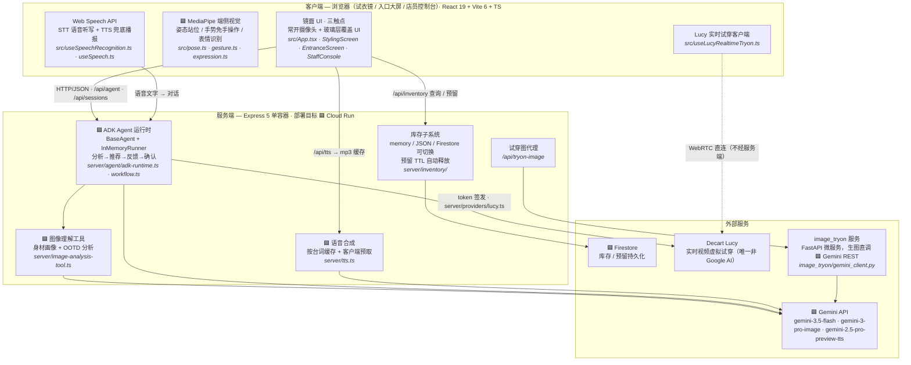

# Fashini — 系统架构与技术栈

> 黑客松汇报材料 · 2026-07-11 · 给队友的一页速览：魔法试衣镜（免手操作 AI 导购）用到了哪些技术、各自负责什么、代码在哪。
>
> 配套 PDF 版（带排版的架构图）：[TECH_STACK.pdf](./TECH_STACK.pdf)

---

## 01 · 系统架构

🟦 = Google 技术。要点：**Lucy 视频流是浏览器 ⇄ Decart 云 WebRTC 直连，不经过我们的服务端**——服务端只签发短时 token（TTL 限制预览时长）。

---

## 02 · Google 技术明细

### AI — Gemini API（`@google/genai`）

| 技术 | 模型 ID | 在项目里做什么 | 代码位置 |
|---|---|---|---|
| Gemini 3.5 Flash | `gemini-3.5-flash` | Agent 对话推理 + 多模态看图：身材画像、OOTD 穿搭分析、推荐理由生成 | `server/agent/` · `server/image-analysis-tool.ts` |
| Gemini 3 Pro Image | `gemini-3-pro-image` | 试穿效果图生成（image_tryon 经 REST 直调）；商品目录图批量生成（`npm run gen:product-images`） | `image_tryon/gemini_client.py` · `scripts/generate-product-images.ts` |
| Gemini TTS | `gemini-2.5-pro-preview-tts` | Agent 语音播报：服务端合成、按台词缓存、客户端预取固定台词 | `server/tts.ts` |

### Agent 框架

| 技术 | 包名 | 在项目里做什么 | 代码位置 |
|---|---|---|---|
| Google ADK | `@google/adk` | Agent 编排运行时：`BaseAgent` + `InMemoryRunner` 事件流，`FunctionTool` 封装图像分析等工具调用；会话状态、工具调用轨迹 | `server/agent/adk-runtime.ts` · `server/image-analysis-tool.ts` |

### 端侧视觉 — 浏览器本地推理（`@mediapipe/tasks-vision`）

| 模型 | 在项目里做什么 | 代码位置 |
|---|---|---|
| PoseLandmarker | 姿态检测：拍摄取景与站位引导（离镜子多远、是否全身入框） | `src/pose.ts` |
| GestureRecognizer | 手势识别：免手操作交互（选款、翻页、确认），不用碰屏幕 | `src/gesture.ts` · `src/useGestureControl.ts` |
| FaceLandmarker | 表情识别：读取用户对推荐的情绪反应，回传给 Agent 调整策略 | `src/expression.ts` · `src/useExpression.ts` |

### Google Cloud

| 技术 | 在项目里做什么 | 代码位置 |
|---|---|---|
| Firestore（`@google-cloud/firestore`） | 库存子系统持久化后端（商品、预留/释放、TTL 清扫），本地开发用 emulator | `server/inventory/` |
| Cloud Run | 部署目标：单容器同时跑 Express API + Agent 运行时 + 前端静态资源，按请求自动扩缩 | `Dockerfile` |

---

## 03 · 非 Google 技术明细

### 第三方 AI

| 技术 | 包名 | 在项目里做什么 | 代码位置 |
|---|---|---|---|
| Decart Lucy | `@decartai/sdk` | 实时视频虚拟试穿：摄像头流 WebRTC 直连 Decart 云端换装。服务端只签发短时 token | `src/useLucyRealtimeTryon.ts` · `server/providers/lucy.ts` |

### 前端

| 技术 | 在项目里做什么 | 代码位置 |
|---|---|---|
| React 19 | 三个触点的 UI：试衣镜（竖屏）、入口大屏（横屏）、店员控制台 | `src/` |
| Vite 6 + TypeScript 5.8 | 构建与开发服务器（dev proxy 把 `/api` 转到 Express）；全栈类型安全 | `vite.config.ts` · `tsconfig.*` |
| Web Speech API（浏览器标准） | `SpeechRecognition` 做语音听写（用户对镜子说话）；`speechSynthesis` 做 Gemini TTS 不可用时的兜底播报 | `src/useSpeechRecognition.ts` · `src/useSpeech.ts` |

### 服务端

| 技术 | 在项目里做什么 | 代码位置 |
|---|---|---|
| Express 5 | API 服务：agent / sessions / inventory / tts / tryon-image 路由 + 静态资源托管 | `server/index.ts` |
| Zod 4 | 所有 API 请求 / Agent 工具入参的 schema 校验 | `server/agent/contracts.ts` 等 |
| sharp | 服务端图像处理（缩放 / 压缩上传的照片） | `server/` |

### Python 微服务

| 技术 | 在项目里做什么 | 代码位置 |
|---|---|---|
| FastAPI + Pydantic | image_tryon 服务：体型匹配 + 试穿图生成编排（生图本身仍调 Gemini） | `image_tryon/service.py` |

---

## 04 · 汇报要点

1. **分层延迟策略。** 毫秒级的手势、表情、姿态在浏览器本地用 MediaPipe 跑（零网络往返）；秒级的推理、看图、生图、语音走 Gemini 云端；持续的实时视频流走 Lucy WebRTC 直连。每一层用的都是该延迟档位下最合适的技术。
2. **AI 能力几乎全由 Google 承担。** Gemini 负责推理、看图、生图、说话；ADK 负责 Agent 编排；MediaPipe 负责端侧视觉；Firestore + Cloud Run 负责数据与部署。
3. **如果评委问「为什么不全用 Google」：** 唯一的例外是 Decart Lucy 的实时视频换装——Gemini 目前没有对应的实时视频生成产品；其余生成式能力（含 Python 服务内的生图）全部走 Gemini。

---

*数据来源：`package.json` / `.env` / 源码扫描 · branch `feature/expression-tts`*
